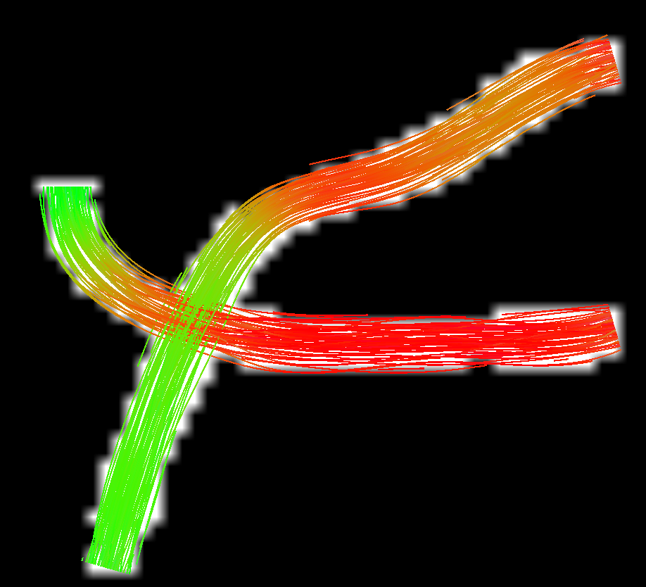
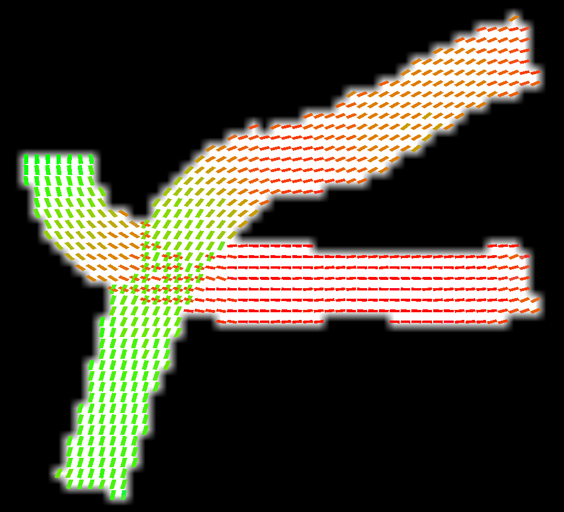

# Getting started
This document is a walkthrough for SymDWI, where, starting from a synthetic bundle, a full DWI will be generated.

First question one would ask is, where are bundle placed, and how do we define them? The first thing we are going to do is define the dimensionality of the volume we will generate, alongside with its voxel size

```python
import numpy as np
import symdwi

dims = (60, 60, 60)
voxel_size = 1.0
```

after that, defining a bundle is straigthforward. A bundle is a _B-Spline_, and to generate a bundle, a B-Spline goes through user-defined _control points_, and around the radius specified (with some _wiggling_ defined by the dispersion parameter), streamlines are fit.
For simplicity, we will define two bundles that stay at a fixed z axis and vary around the x and y axis.

```python

b1_pts = np.array([
    [10, 50, 30], 
    [20, 45, 30],
    [28, 41, 30],
    [37, 38, 30],
    [43, 30, 30],
    [47, 20, 30],
    [50, 10, 30]
])

b1 = symdwi.Bundle(
    b1_pts,
    n_streamlines=500,
    radius=3.0,
    n_samples=100,
    degree=3,
    dispersion=0.25
)


b2_pts = np.array([
    [10, 29, 30], 
    [18, 28, 30],
    [24, 28, 30],
    [37, 28, 30],
    [42, 29, 30],
    [50, 33, 30],
    [53, 40, 30]
])

b2 = symdwi.Bundle(
    b2_pts,
    n_streamlines=500,
    radius=3.0,
    n_samples=100,
    degree=3,
    dispersion=0.25
)
```

Once we are satisfied with the bundle(s) generated, we move onto defining the parameters that define the DWI simulation itself, we will start by getting some bvals and bvecs

```python
bvals, bvecs = symdwi.generate_bvals_bvecs(shells=[(1000, 8), (2000, 8), (3000, 8)], n_b0=1)
```
Notice that it's possible to specify the number of b0 values prepended to the array. 
Users are also more than welcome to generate and/or load their own bvals and bvecs, though if the objective is to load downstream onto FSL/Mrtrix, its critical that they respect the _radiological_ convention that those tool expect. This is also possible to do when saving the final dwi produced, see `world_bvecs_to_fsl` and `save_dwi`.

Now that we have bvals and bvecs, its time to model the diffusivity of water in the phantom! We do so by defining a value of DWIParameters type:

```python
params = symdwi.DWIParameters(
    f_intra=0.7,
    f_extra=0.3,
    f_csf=0.0,
    axon_radius_um=1.0,
    te_ms=80.0,
    background_csf=0.00,
)
```

We left most parameters to preset values as they are sensible defaults for the experiment we are performing here.

The parameters that DWIParameters describe belong to the Standard Model of White Matter, which predicts the DWI signal that would arise from a given fiber population geometry under a set of biophysical assumptions.
To better understand what these assumptions are, see the doc for `DWIParameters`.

We can now start the simulation process, which is pretty straightforward
```python
dwi, affine, gt = symdwi.simulate_dwi(
    [b1, b2],
    bvals,
    bvecs,
    params,
    origin=np.array([0.0, 0.0, 0.0]),
    dims=dims,
    voxel_size=voxel_size,
    snr=None, # No rician noise
    return_groundtruth=True
)
```

What this simulation does is the following:
1. Given a set of bundles, go through each of its points, and keep a count of each direction all the streamlines take in that voxel. This is done by binning each direction onto a sphere with a large amount of vertices (repulsion724 by default). This is the per-voxel orientation distribution function.
2. After normalizing each voxel direction histogram to 1, these values can be used as weights to compute the DWI signal via the Standard Model of white matter. For example, if we are insterested in computing the intra-axonal signal $S_{\text{intra}}$ what we compute is 
$$S_{\text{intra}}=\sum_i^nS_{\text{stick}}(d_i)\cdot w_i$$
where $d_i$ is $i$-th direction with its corresponding weight $w$ and $S_{\text{stick}}$ is 
$$e^{-bd_{\text{axial}}\cos^2\theta({g, d_i})}$$
where $\cos^2\theta({g, d_i})$ is the squared cosine of the angle between the gradient direction $g$ and the fiber direction $d_i$.

Finally, we can save the results.

```{python}
symdwi.save_dwi(dwi, affine, bvals, bvecs, "results")
symdwi.save_groundtruth(gt, affine, "results")
symdwi.save_bundles([b1, b2], 'results/tractogram.tck')
```

We also get as output the ground truth, consisting of multiple objects: 
1. White matter mask (where True is set for each voxel containing at least one streamline passing through it)
2. Fiber fraction volume. To compute said volume, for each voxels we count how many streamline points fall into it. Then, using the axonal radius parameter, we compute the effective volume those streamlines occupy in a voxel (modeling a streamline as a cylinder with some cross section). Finally, the value measured is normalized such that no voxel can exceed the intra_axonal volume occupied in a give voxel. This metric can be used to visualize how dense a voxel is relative to the maximally dense one in the volume.
3. Peaks for each ODF, sorted by amplitude.
4. Amplitude per peak. 
5. The sphere object used for direction discretisation.

We can then load the results onto mrtrix to see what we produced:

